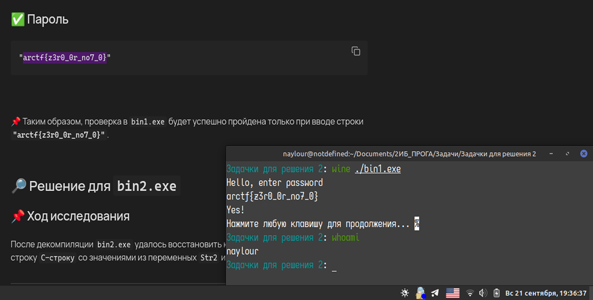
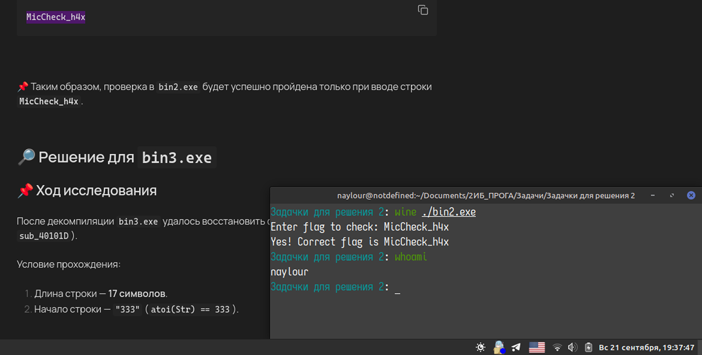
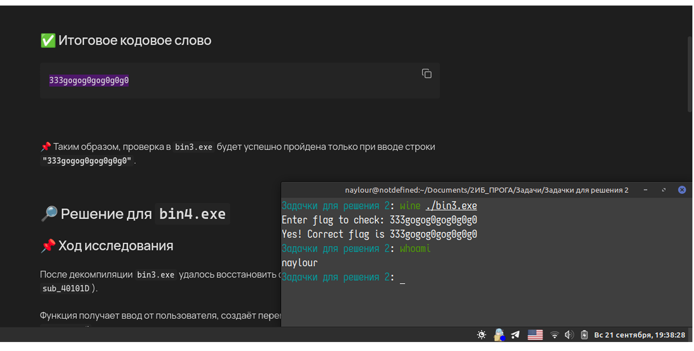
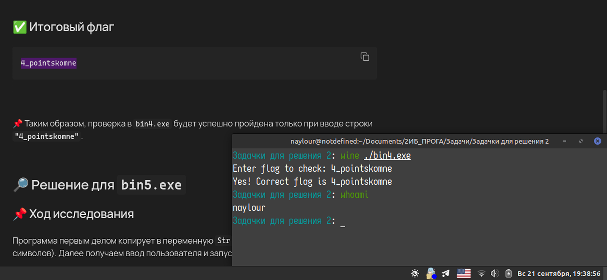
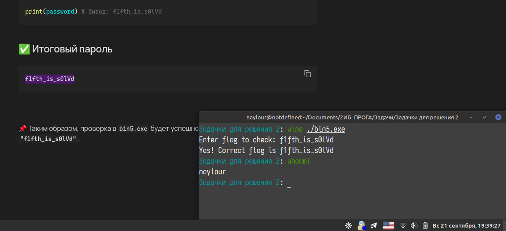

1. [[#🔎 Решение для `bin1.exe`|🔎 Решение для `bin1.exe`]]
2. [[#🔎 Решение для `bin2.exe`|🔎 Решение для `bin2.exe`]]
3. [[#🔎 Решение для `bin3.exe`|🔎 Решение для `bin3.exe`]]
4. [[#🔎 Решение для `bin4.exe`|🔎 Решение для `bin4.exe`]]
5. [[#🔎 Решение для `bin5.exe`|🔎 Решение для `bin5.exe`]]

**Выполнил студент курса 2ИБ**
*Убайдуллозода Шахриёри*

## 🔎 Решение для `bin1.exe`



### 📌 Ход исследования


После декомпиляции `bin1.exe` удалось восстановить код, который сравнивает входящую строку с `C-строкой` `"arctf{z3r0_0r_no7_0}"` с помощью `strcmp`.

Функция `strcmp` сравнивает 2 `C-строки` и выдаёт 3 исхода:
1. `0` - строки равны
2. `< 0` - строка `s1` **"меньше"** строки `s2`(первый не совпавший символ в `s1` имеет меньший код)
3. `> 0` — строка `s1` **"больше"** строки `s2`.

### ✅ Пароль

```
"arctf{z3r0_0r_no7_0}"
```


📌 Таким образом, проверка в `bin1.exe` будет успешно пройдена только при вводе строки **`"arctf{z3r0_0r_no7_0}"`**.


## 🔎 Решение для `bin2.exe`



### 📌 Ход исследования

После декомпиляции `bin2.exe` удалось восстановить код, который сравнивает входящую строку `C-строку` со значениями из переменных `Str2` и `aMiccheckH4y` с помощью `strcmp`.

---

#### Значение переменных в памяти
- `Str2 = "MicCheck_h4w"`
- `aMiccheckH4y = "MicCheck_h4y"`


Зная как работает функция `strcmp` и исходя из условий что при первом сравнении входящая строка должна быть "больше", а во втором "меньше", и то, что эти строки оканчиваются на символы `w` и `y`, это нам даёт предположить, что входящая строка в конце должна иметь символ между `w` и `y` => `x`.


### ✅ Входящая строка

```
MicCheck_h4x
```


📌 Таким образом, проверка в `bin2.exe` будет успешно пройдена только при вводе строки **`MicCheck_h4x`**.


## 🔎 Решение для `bin3.exe`



### 📌 Ход исследования

После декомпиляции `bin3.exe` удалось восстановить функцию проверки кода (`sub_40101D`).

Условие прохождения:

1. Длина строки — **17 символов**.
2. Начало строки — `"333"` (`atoi(Str) == 333`).

#### Остальные символы проверяются через вспомогательную функцию:

^9dcbbe

```c
int __cdecl sub_401000(int a1, int a2) {
    return *(char *)(a2 - 1 + a1);
}
```

На самом деле это обычная выборка символа по индексу:

```c
char sub_401000(char *chars, int idx) {
    return chars[idx - 1];
}
```

---

### 📖 Разбор условий по шагам

#### Базовые требования

* `len(Str) == 17`
* `Str[0..2] = "333"`

Итого: `333???????????????`

---

#### Фиксированные символы `'o'` (ASCII 111)

* `Str[4]  = 'o'`
* `Str[6]  = 'o'`
* `Str[10] = 'o'`

Итого: `333?o?o??o???????`

---

#### Группа одинаковых символов `'g'` (ASCII 103)

Условиями установлено, что одинаковы:
`Str[3], Str[5], Str[7], Str[9], Str[11], Str[13], Str[15]`

Причём конкретно проверяется:

* `Str[15] = 'g'`
* следовательно, все перечисленные тоже `'g'`.

Итого: `333gogog?gog?g?g?`

---

#### Группа одинаковых символов `'0'` (ASCII 48)

Одинаковы:
`Str[8], Str[12], Str[14], Str[16]`

Причём конкретно проверяется:

* `Str[8] = '0'`
* значит все из группы `'0'`.

Итого: `333gogog0gog0g0g0`

---

### ✅ Итоговое кодовое слово

```
333gogog0gog0g0g0
```


📌 Таким образом, проверка в `bin3.exe` будет успешно пройдена только при вводе строки **`"333gogog0gog0g0g0"`**.


## 🔎 Решение для `bin4.exe`



### 📌 Ход исследования

После декомпиляции `bin4.exe` удалось восстановить функцию проверки кода (`sub_40101D`).

Функция получает ввод от пользователя, создаёт переменную(`v1`) где хранит `длину строки * 4`.

Далее идёт проверка через функцию `sub_401000`, которая встречалась в [[bin3#^9dcbbe|предыдущем бинарнике]]. `v1 == sub_401000(Str, 1)` означает что первый символ в введённой строке, должен быть символом под ASCII номеру, который лежит в переменной `v1`

#### strncmp

Далее идёт сравнение при помощи функции `strncmp`, которая работает так же, как и `strcmp`, но может ограничить количество сравниваемых элементов.

`!strncmp(Str, Str2, 8u)`

Значение переменной `Str2` в памяти равно `4_points`

Выражение выше вернёт `true`, только если строки вплоть до 8-го элемента схожи, то есть равны `4_points`. Отсюда теперь следует что `v1` должен быть символом `4`, то есть число `52`. 

`52 / 4 = 13` - именно такая длина у пароля.

Далее идёт такое условие `!strcmp(Str1, aKomne)`, где `aKomne = "komne"`. Вот тут происходит так называемый `stack overflow`. Программа устроена так, что она намерено позволяет переполнить буфер `Str` чтобы оставшаяся часть пароля перешла в буфер `Str1`.

То есть, после ввода правильного пароля, его часть после `4_points` переходит в `Str1`. Отсюда делаем вывод, что условие вернёт `true`, только если символы в `Str1` совпадут с `"komne"`. 

### ✅ Итоговый флаг

```
4_pointskomne
```


📌 Таким образом, проверка в `bin4.exe` будет успешно пройдена только при вводе строки **`"4_pointskomne"`**.


## 🔎 Решение для `bin5.exe`


### 📌 Ход исследования

Программа первым делом копирует в переменную `Str` c-строку `"f2hwldozg|:wbq"`(15 символов). Далее получаем ввод пользователя и запускается цикл `for`.

Всего произойдёт 15 итераций, внутри цикла производится проверка  `i + v3[i] != Str[i]`,  которая проверяет каждый введёный символ на соответствие с `"ключом" Str` при возврате положительного значения завершает работу программы.

Точнее будет сказать, что `Str` - это уже зашифрованный пароль, а его расшифровка происходит "на лету".

Можем для удобства переписать это условие в выражение и напишем программу для создания пароля по ключу `Str`:

1. Выражение
> v3[i] = Str[i] - i

2. Маленькая программа:
```python
KEY = "f2hwldozg|:wbq"

chars = []

for i, char in enumerate(KEY):
	new_char = chr(ord(char) - i)
	chars.append(new_char)
	
password = "".join(chars)

print(password) # Вывод: f1fth_is_s0lVd
```

### ✅ Итоговый пароль

```
f1fth_is_s0lVd
```


📌 Таким образом, проверка в `bin5.exe` будет успешно пройдена только при вводе строки **`"f1fth_is_s0lVd"`**.